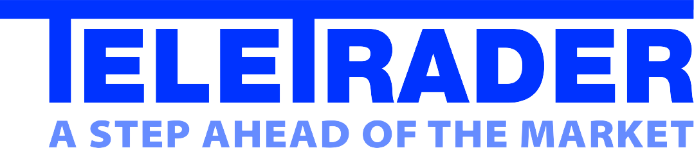
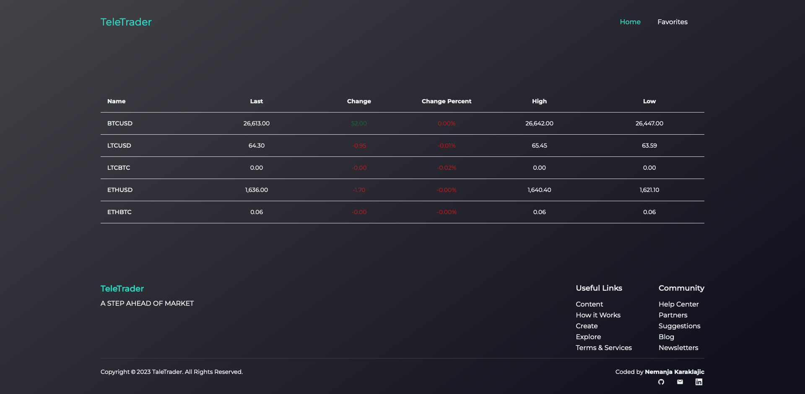
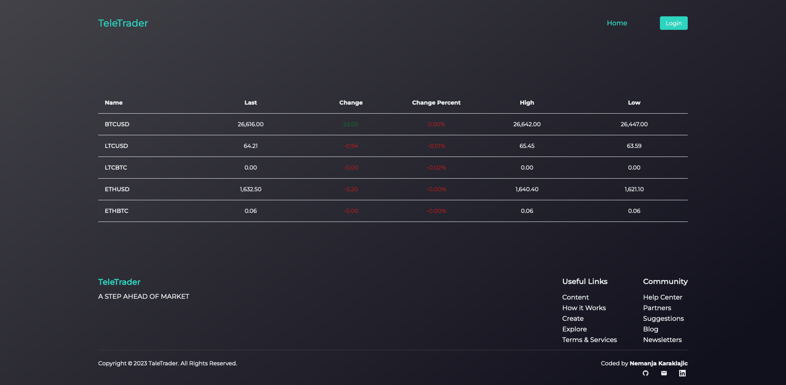
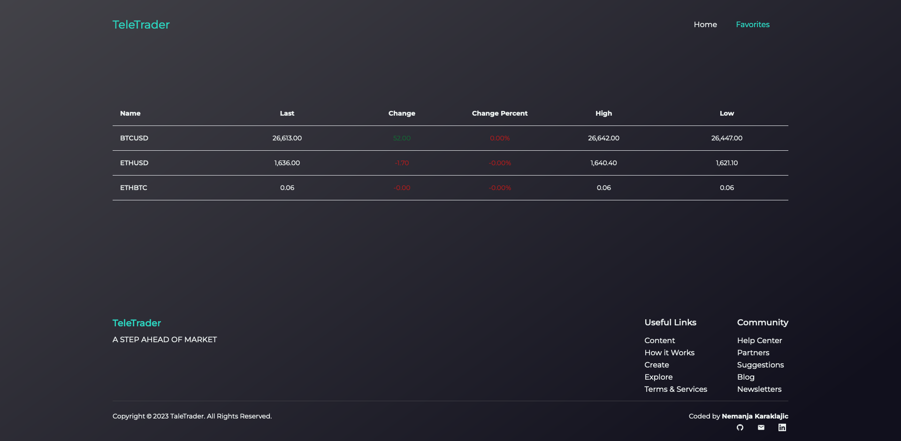
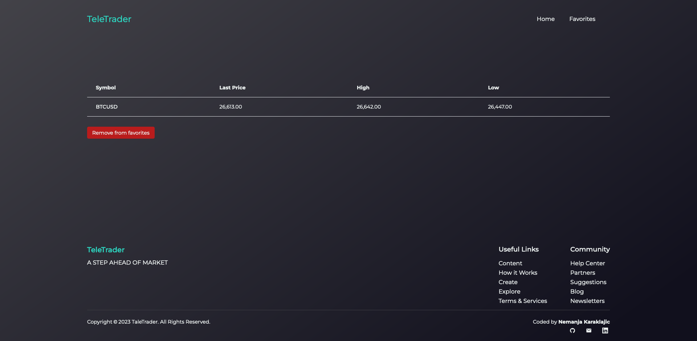

[![LinkedIn][linkedin-shield]][linkedin-url]

<!-- PROJECT LOGO -->
<br />
<div align="center">
  <a href="https://www.teletrader.rs/">
    
  </a>

<h3 align="center">Crypto Currency Monitoring</h3>

[//]: # (  <p align="center">)

[//]: # (    <br />)

[//]: # (    <a href="https://github.com/letStayFoolish/teletrader-assignment-project"><strong>Explore the docs »</strong></a>)

[//]: # (    <br />)

[//]: # (    <br />)

[//]: # (    <a href="https://teletrader-assignment-project.vercel.app/">View Demo</a>)

[//]: # (    ·)

[//]: # (    <a href="https://github.com/letStayFoolish/teletrader-assignment-project/issues">Report Bug</a>)

[//]: # (    ·)

[//]: # (    <a href="https://github.com/letStayFoolish/teletrader-assignment-project/issues">Request Feature</a>)

[//]: # (  </p>)
</div>


<!-- TABLE OF CONTENTS -->
<details>
  <summary>Table of Contents</summary>
  <ol>
    <li>
      <a href="#about-the-project">About The Project</a>
      <ul>
        <li><a href="#built-with">Built With</a></li>
      </ul>
    </li>
    <li>
      <a href="#getting-started">Getting Started</a>
      <ul>
        <li><a href="#prerequisites">Prerequisites</a></li>
        <li><a href="#installation">Installation</a></li>
      </ul>
    </li>
    <li><a href="#figma-design">Figma Design</a></li>
    <li><a href="#projects-checklists">Project's checklists</a></li>
    <li><a href="#license">License</a></li>
    <li><a href="#contact">Contact</a></li>
  </ol>
</details>


<!-- ABOUT THE PROJECT -->
## About The Project


<details><summary><b>Show all</b></summary>



</details>

`Project Description`

### Crypto Currency Monitoring

Crypto Currency Monitoring is spa test assignment project. The purpose of this test is to help TeleTrader ascertain the qualification and skill level of the prospective candidate applying for the Junior React Developer position.
The project itself is related to TeleTrader's core business (developing applications for the financial industry), so any prior knowledge of the financial industry is an asset.

### Project Description
This is a Single Page Application (SPA) built with React and created using the Create React App (CRA) method. The application allows users to monitor the latest data for the top 5 cryptocurrencies. It provides real-time updates for cryptocurrency pairs from Bitfnex using WebSockets. Users can also view detailed information for individual currency pairs, add or remove pairs to/from their favorites list, and access a dedicated "Favorites" page that displays their selected pairs.

### Features

**Home Page (`/`)**: The home page displays information for the top 5 cryptocurrency pairs, including:

 - Cryptocurrency name
 - Last price
 - Change
 - Change percent
 - High price
 - Low price

This data is updated in real-time via WebSocket connections to the Bitfnex website.

**Details Page (`/details/:symbol`)**: Users can click on a cryptocurrency pair's name on the home page to navigate to the details page. The details page provides information for the selected currency pair, including:

 - Symbol
 - Last price
 - High price
 - Low price

Unlike the home page, this data does not have real-time updating.

**Favorites**: Logged-in users can add or remove cryptocurrency pairs to/from their favorites list. The state of logged-in status and favorite pairs is stored in local storage.

**Favorites Page (`/favorites`)**: The favorites page displays cryptocurrency pairs that the logged-in user has added to their favorites list. This page also receives real-time updates via WebSocket connections.

<p align="right">(<a href="#readme-top">back to top</a>)</p>


### Built With

* [![React][React.js]][React-url]

### Technologies:
### Frontend:

- HTML5;
- CSS3:
    - Flexbox;
    - Grid Layout;
    - Positioning;
    - Adaptive UI;
    - Media Queries;
- Tailwind
- JavaScript:
    - CamelCase style;
    - Object-oriented programming;
    - Promise, asynchronous functions;
    - API (Application Programming Interface);
- Webpack:
    - Project files are bundled using [Webpack](https://webpack.js.org/) technology, which takes the dependencies and generates a dependency graph allowing web developers to use a modular approach for their web application development purposes.
- React JS:
    - Create React App;
    - JSX;
    - Functional components;
    - Hooks.
- WebSockets

<p align="right">(<a href="#readme-top">back to top</a>)</p>

<!-- GETTING STARTED -->
<!-- USAGE EXAMPLES -->
## Getting started

### Prerequisites

Before you can start using the Crypto Currency Monitoring, ensure you have the following prerequisites installed on your system:

**Node.js:** Make sure you have Node.js installed. You can download it [here](https://nodejs.org/en).

### Installation

1. Download repo - [click here](https://github.com/letStayFoolish/teletrader-assignment-project), or:

2. Clone the Repository: Begin by cloning this repository to your local machine using the following command:
```sh
   git clone https://github.com/letStayFoolish/teletrader-assignment-project
```

3. Navigate to the Directory: Change your current directory to the project folder:
```ssh
cd teletrader-assignment-project
```
4. Install Dependencies: Install the required dependencies using npm:
```ssh
npm install
```

### Running the Application

Once you have completed the installation process, you can run the Movies Explorer App:
1. Development Mode: To run the app in development mode, use the following command:
```ssh
npm start
```
This will start the development server, and you can access the app in your web browser at http://localhost:3000.

2. Production Build: To create a production-ready build of the app, use the following command:
```ssh
npm run build
```
This will generate optimized production files in the build directory.


### Accessing the Application

#### Usage
 - Upon launching the application, you will be directed to the home page ('**/**') where you can monitor the top 5 cryptocurrency pairs with live updates.

 - Click on the name of a cryptocurrency pair to view its details on the details page (`/details/:symbol`).

 - If you are logged in, you can add or remove cryptocurrency pairs to/from your favorites list.

 - Access the "Favorites" page (`/favorites`) to view your selected pairs with live updates.

#### Local Storage
The application uses local storage to store and retrieve the following data:

 - `isLoggedIn`: A boolean value representing the user's logged-in status.
 - `symbol`: An array of cryptocurrency pairs that the user has added to their favorites list.

<p align="right">(<a href="#readme-top">back to top</a>)</p>

<!-- FIGMA -->

<!-- CHECKLISTS -->

<!-- LICENSE -->
## License

````
This project is licensed under the TeleTrader License.
````
<hr>

Copyright (c) _2023_ _Nemanja Karaklajic_


<!-- CONTACT -->
## Contact

Nemanja Karaklajic

E-mail: [nemanjakaraklajic90@gmail.com](mailto:nemanjakaraklajic90@gmail.com)

Website: [nemanjakaraklajic.com](https://chilicode.netlify.app/)

LinkedIn profile: [linkedIn](https://twitter.com/twitter_handle)

Project Link: [https://github.com/letStayFoolish/teletrader-assignment-project/](https://github.com/letStayFoolish/teletrader-assignment-project/)


<p align="right">(<a href="#readme-top">back to top</a>)</p>


<!-- MARKDOWN LINKS & IMAGES -->
<!-- https://www.markdownguide.org/basic-syntax/#reference-style-links -->
[contributors-shield]: https://img.shields.io/github/contributors/github_username/repo_name.svg?style=for-the-badge
[contributors-url]: https://github.com/github_username/repo_name/graphs/contributors
[forks-shield]: https://img.shields.io/github/forks/github_username/repo_name.svg?style=for-the-badge
[forks-url]: https://github.com/github_username/repo_name/network/members
[stars-shield]: https://img.shields.io/github/stars/github_username/repo_name.svg?style=for-the-badge
[stars-url]: https://github.com/github_username/repo_name/stargazers
[issues-shield]: https://img.shields.io/github/issues/github_username/repo_name.svg?style=for-the-badge
[issues-url]: https://github.com/github_username/repo_name/issues
[license-shield]: https://img.shields.io/github/license/github_username/repo_name.svg?style=for-the-badge
[license-url]: https://github.com/github_username/repo_name/blob/master/LICENSE.txt
[linkedin-shield]: https://img.shields.io/badge/-LinkedIn-black.svg?style=for-the-badge&logo=linkedin&colorB=555
[linkedin-url]: https://www.linkedin.com/in/nemanjakaraklajic30111990/
[product-screenshot]: images/screenshot.png
[Next.js]: https://img.shields.io/badge/next.js-000000?style=for-the-badge&logo=nextdotjs&logoColor=white
[Next-url]: https://nextjs.org/
[React.js]: https://img.shields.io/badge/React-20232A?style=for-the-badge&logo=react&logoColor=61DAFB
[React-url]: https://reactjs.org/
[Vue.js]: https://img.shields.io/badge/Vue.js-35495E?style=for-the-badge&logo=vuedotjs&logoColor=4FC08D
[Vue-url]: https://vuejs.org/
[Angular.io]: https://img.shields.io/badge/Angular-DD0031?style=for-the-badge&logo=angular&logoColor=white
[Angular-url]: https://angular.io/
[Svelte.dev]: https://img.shields.io/badge/Svelte-4A4A55?style=for-the-badge&logo=svelte&logoColor=FF3E00
[Svelte-url]: https://svelte.dev/
[Laravel.com]: https://img.shields.io/badge/Laravel-FF2D20?style=for-the-badge&logo=laravel&logoColor=white
[Laravel-url]: https://laravel.com
[Bootstrap.com]: https://img.shields.io/badge/Bootstrap-563D7C?style=for-the-badge&logo=bootstrap&logoColor=white
[Bootstrap-url]: https://getbootstrap.com
[JQuery.com]: https://img.shields.io/badge/jQuery-0769AD?style=for-the-badge&logo=jquery&logoColor=white
[JQuery-url]: https://jquery.com 
